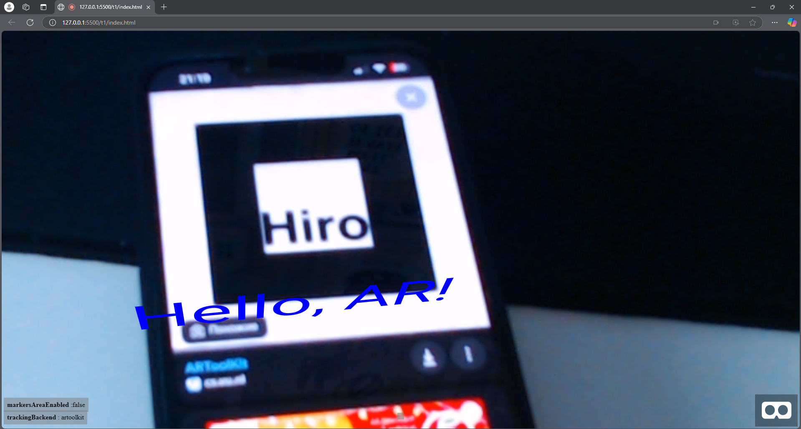
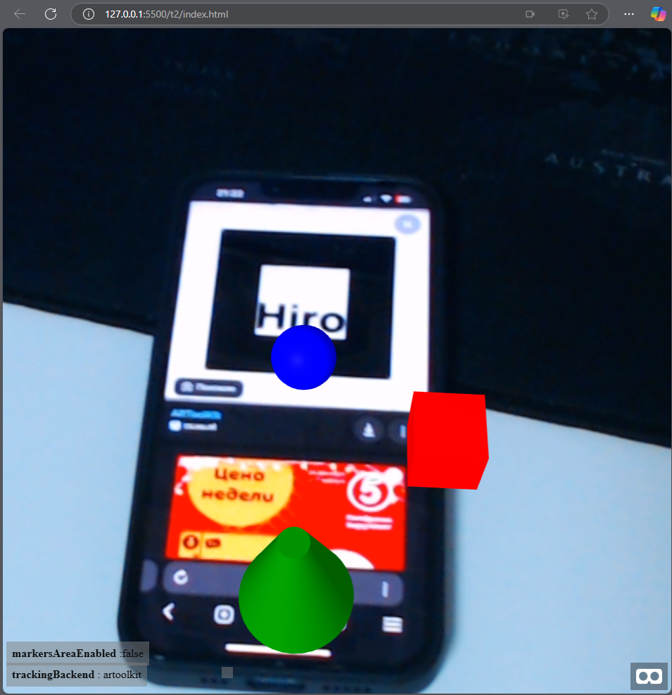
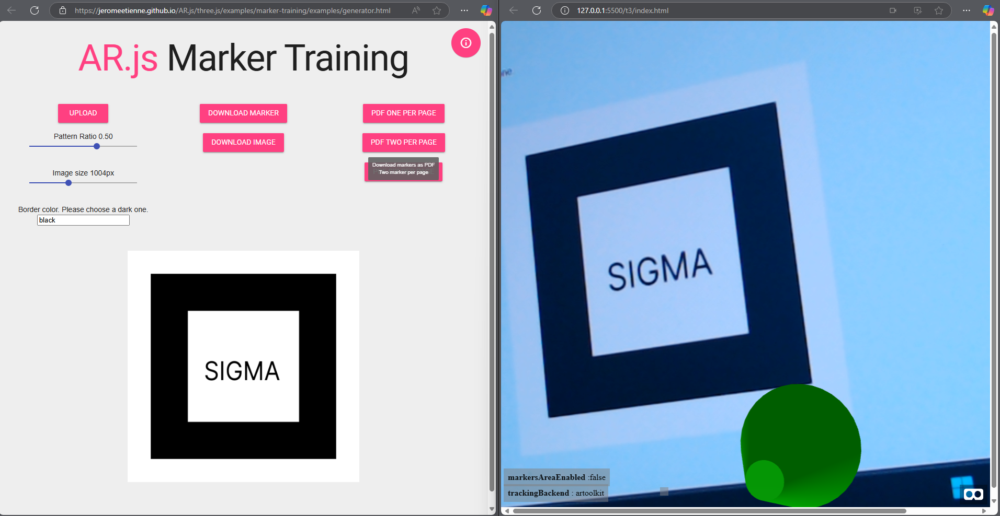

# Задачи-эксперименты AR.js

## **Задача 1**

## **Задача 2**

## **Задача 3**

## **Задача 4**
https://github.com/user-attachments/assets/13f54f5d-4cbd-435d-b187-2eae845036e5

## **Задача 5**

https://github.com/user-attachments/assets/4ffbfb1f-cf78-4124-a85b-bb3afc5caaee

## **Задача 6**

https://github.com/user-attachments/assets/5588d686-e387-4a30-a814-440b3c3078e5

## **Задача 7**

https://github.com/user-attachments/assets/6a9d90da-6cab-4fd4-90b2-5e67d8de1719

## **Задача 8**

https://github.com/user-attachments/assets/b4c950ba-6386-4515-8f78-e70045d88192

## **Задача 9**

https://github.com/user-attachments/assets/d0dc63e3-cf9d-4a8c-809e-5c8dae68bfd2

## **Задача 10**

https://github.com/user-attachments/assets/825ceb4b-16d5-4b8b-ac69-a06630246bec

## **Задача 12**

https://github.com/user-attachments/assets/452ce5be-098b-403c-896d-5650e217c3a2

## **Задача 13**

https://github.com/user-attachments/assets/0ea8dc30-5a9a-4ddb-9512-e988932038dd

## **Задача 14**

https://github.com/user-attachments/assets/d3a52e34-9b59-4eab-a8fb-bd7032e58191

## **Задача 15**

## **Задача 16**

## **Задача 18**

https://github.com/user-attachments/assets/6cccc187-b3fb-4962-9971-694322b72086

## **Задача 19**

https://github.com/user-attachments/assets/49c2e2fe-cbf8-48b8-85e1-a60876e579d5

## **Задача 20**

https://github.com/user-attachments/assets/82f6df80-85eb-498c-beb8-e4e6270cb73a

